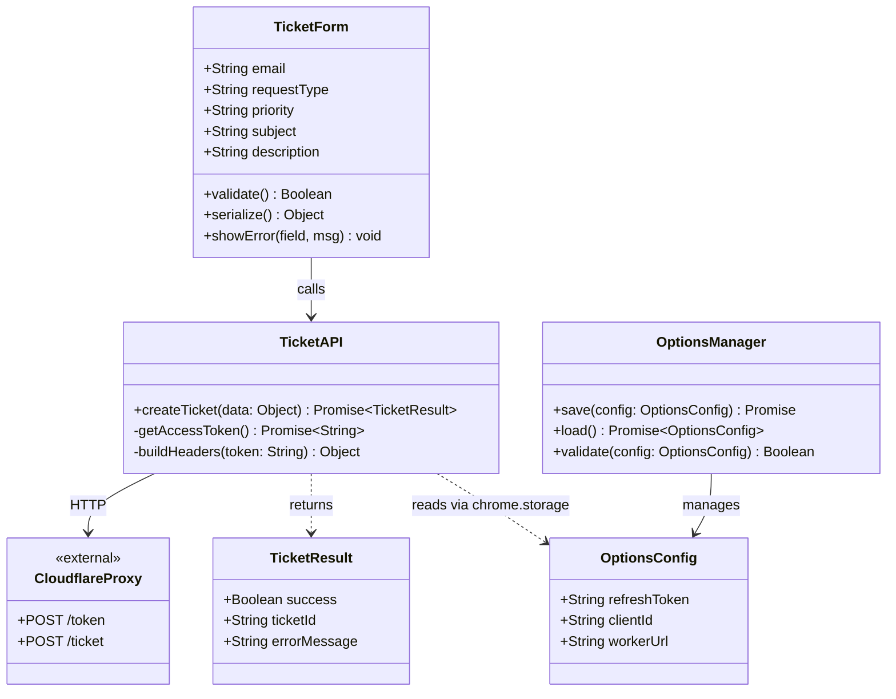

# Klassendiagramm: ArgoTicketTool

```mermaid
classDiagram
    class TicketForm {
        +String email
        +String requestType
        +String priority
        +String subject
        +String description
        +validate() Boolean
        +serialize() Object
        +showError(field, msg) void
    }

    class TicketAPI {
        +createTicket(data: Object) Promise~TicketResult~
        -getAccessToken() Promise~String~
        -buildHeaders(token: String) Object
    }

    class CloudflareProxy {
        <<external>>
        +POST /token
        +POST /ticket
    }

    class OptionsManager {
        +save(config: OptionsConfig) Promise
        +load() Promise~OptionsConfig~
        +validate(config: OptionsConfig) Boolean
    }

    class OptionsConfig {
        +String refreshToken
        +String clientId
        +String workerUrl
    }

    class TicketResult {
        +Boolean success
        +String ticketId
        +String errorMessage
    }

    TicketForm --> TicketAPI : calls
    TicketAPI --> CloudflareProxy : HTTP
    TicketAPI ..> TicketResult : returns
    OptionsManager --> OptionsConfig : manages
    TicketAPI ..> OptionsConfig : reads via chrome.storage
```
