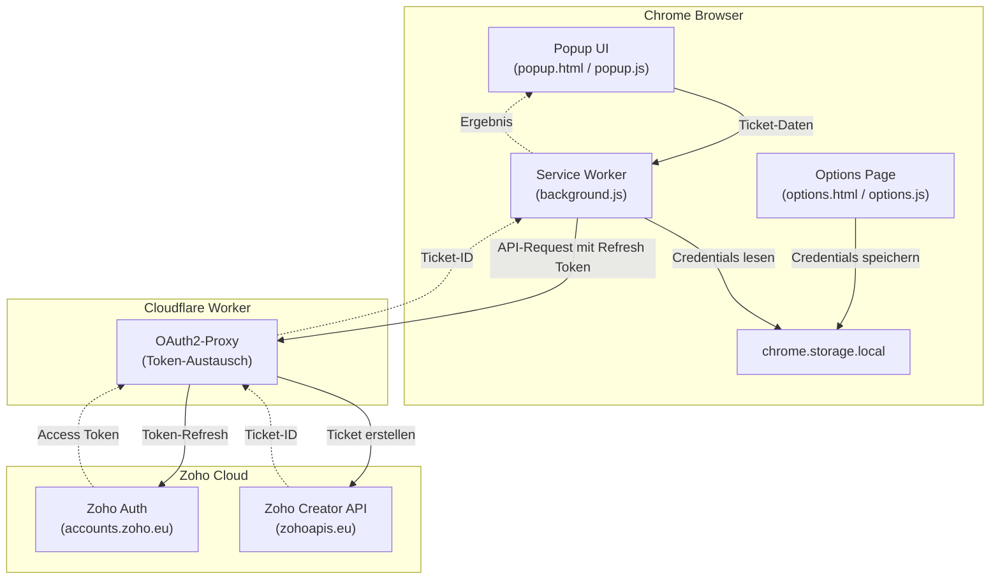

# Komponentendiagramm: ArgoTicketTool

```mermaid
graph TD
    subgraph Chrome["Chrome Browser"]
        Popup["Popup UI\n(popup.html / popup.js)"]
        Options["Options Page\n(options.html / options.js)"]
        BG["Service Worker\n(background.js)"]
        Storage["chrome.storage.local"]
    end

    subgraph Proxy["Cloudflare Worker"]
        CF["OAuth2-Proxy\n(Token-Austausch)"]
    end

    subgraph Zoho["Zoho Cloud"]
        Auth["Zoho Auth\n(accounts.zoho.eu)"]
        API["Zoho Creator API\n(zohoapis.eu)"]
    end

    Popup -->|"Ticket-Daten"| BG
    Options -->|"Credentials speichern"| Storage
    BG -->|"Credentials lesen"| Storage
    BG -->|"API-Request mit Refresh Token"| CF
    CF -->|"Token-Refresh"| Auth
    CF -->|"Ticket erstellen"| API
    Auth -.->|"Access Token"| CF
    API -.->|"Ticket-ID"| CF
    CF -.->|"Ticket-ID"| BG
    BG -.->|"Ergebnis"| Popup
```
