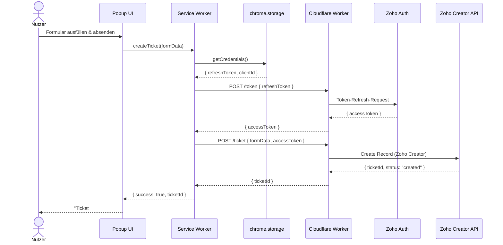

# Sequenzdiagramm: OAuth2-Flow & Ticket-Erstellung

```mermaid
sequenceDiagram
    actor Nutzer
    participant Popup as Popup UI
    participant BG as Service Worker
    participant Storage as chrome.storage
    participant CF as Cloudflare Worker
    participant ZohoAuth as Zoho Auth
    participant ZohoAPI as Zoho Creator API

    Nutzer->>Popup: Formular ausfüllen & absenden
    Popup->>BG: createTicket(formData)
    BG->>Storage: getCredentials()
    Storage-->>BG: { refreshToken, clientId }
    BG->>CF: POST /token { refreshToken }
    CF->>ZohoAuth: Token-Refresh-Request
    ZohoAuth-->>CF: { accessToken }
    CF-->>BG: { accessToken }
    BG->>CF: POST /ticket { formData, accessToken }
    CF->>ZohoAPI: Create Record (Zoho Creator)
    ZohoAPI-->>CF: { ticketId, status: "created" }
    CF-->>BG: { ticketId }
    BG-->>Popup: { success: true, ticketId }
    Popup-->>Nutzer: "Ticket #12345 erfolgreich erstellt"
```
